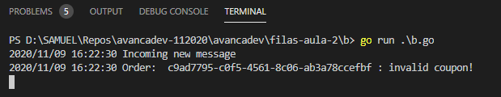
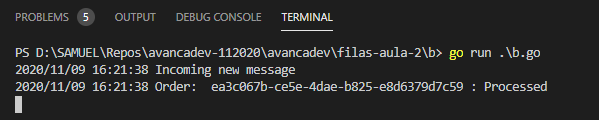
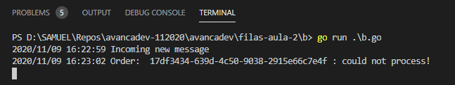

## Desafio 2

- Inicie o RabbitMQ e faça as configurações das duas filas e das duas exchanges.

- Coloque os microsserviços para funcionar.

- Tire 3 prints de sua de sua tela mostrando os microsserviços funcionando nas 3 situações: Cupom inválido, Processed e Connection error.

### Cupom Inválido

### Processado

### Error de conexão

